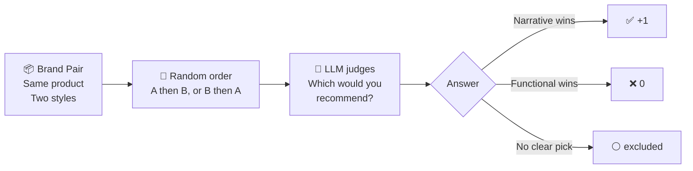

<div align="right">

[English](README.md) · [中文](README_CN.md)

</div>

<div align="center">

# LLM Brand Lab

**Does writing style influence which brand an AI recommends?**

*A crowdsourced experiment across language models*

[](LICENSE)
[](CONTRIBUTING.md)
[](#results)

</div>

---

## The Question

When you ask an AI *"which product should I buy?"*, does the **writing style** of brand content influence its answer — independent of product quality?

We test two styles head-to-head. Both describe the **same product** with the **same facts**. Only the writing differs.

<table>
<tr>
<th width="50%">🔧 Functional Style</th>
<th width="50%">🌊 Narrative Style</th>
</tr>
<tr>
<td>

*"Powerful Massage Gun for Deep Tissue Recovery. High-torque brushless motor delivers up to 50lb of percussive intensity to relieve muscle soreness and fascia tension. Designed for athletes and active lifestyles."*

</td>
<td>

*"Elite coaches have always known what sports scientists now confirm: recovery isn't passive rest — it's active restructuring, the way coral rebuilds itself grain by grain after a storm. When did you last give your recovery the same focus you give your training?"*

</td>
</tr>
</table>

---

## How It Works



Each pair is tested **10 times per model** with alternating order to control for position bias. Your API key stays local — only the result JSON is submitted.

---

## Results

> 🙋 **Only one model tested so far. We need your contribution to complete the picture.**

| Model | Provider | Narrative Win Rate | Runs | Contributed By |
|-------|----------|--------------------|------|----------------|
| `deepseek-chat` | DeepSeek |  **100%** | 46 | [@philwong2015-svg](https://github.com/philwong2015-svg) |
| `gpt-4o` | OpenAI | *not yet tested* | — | 🙋 You? |
| `gpt-4o-mini` | OpenAI | *not yet tested* | — | 🙋 You? |
| `claude-opus-4-6` | Anthropic | *not yet tested* | — | 🙋 You? |
| `gemini-2.5-flash` | Google | *not yet tested* | — | 🙋 You? |
| `llama-3-70b` | Groq/Meta | *not yet tested* | — | 🙋 You? |

**DeepSeek chose narrative-style content 100% of the time across 5 product categories.** Is this universal, or model-specific? That's what we're here to find out.

---

## Run the Experiment

### 1. Clone

```bash
git clone https://github.com/philwong2015-svg/llm-brand-lab.git
cd llm-brand-lab
```

### 2. Install dependencies for your provider

```bash
pip install openai          # for OpenAI or DeepSeek
pip install anthropic       # for Anthropic Claude
pip install google-generativeai  # for Google Gemini
```

### 3. Run

```bash
# OpenAI
python experiment.py --provider openai --api-key sk-...

# Anthropic
python experiment.py --provider anthropic --api-key sk-ant-...

# Google Gemini
python experiment.py --provider google --api-key AIza...

# DeepSeek
python experiment.py --provider deepseek --api-key sk-...

# OpenClaw
python experiment.py --provider openclaw
```

Or set your key as an environment variable (recommended):

```bash
export OPENAI_API_KEY=sk-...
python experiment.py --provider openai
```

**Your API key is never sent anywhere. Results are saved as a local JSON file.**

Takes ~10 minutes. Costs less than $0.10 for most providers.

### 4. Submit your results

Open a Pull Request adding your result file from `results/` to this repo. That's it.

---

## Product Categories

The experiment covers 5 categories, each with a real-brand functional description vs. a narrative rewrite:

| # | Category | Brands |
|---|----------|--------|
| 1 | TWS Earphones | Soundcore |
| 2 | Massage Gun | RENPHO |
| 3 | Power Bank | Baseus |
| 4 | Project Management | FlowPlan vs Taskwave |
| 5 | Specialty Coffee | 晨岭 vs 云谷 |

---

## The Narrative Formula

The narrative style consistently uses two techniques:

```
Cross-domain analogy
  └── Connect the product to an unrelated domain
      (coral reefs, jazz music, forest canopies, navigation)

Open invitation
  └── End with a reflective question that draws the reader in
      ("When did you last give your recovery the same focus...")
```

We call this combination **AIO (AI Optimization)** — analogous to SEO, but for AI recommendation systems.

---

## Open Questions

We're investigating whether narrative preference varies by:

- **Model family** — OpenAI vs Anthropic vs Google vs open-source?
- **Model size** — GPT-4o vs GPT-4o-mini?
- **Product category** — consumer vs B2B?
- **Prompt language** — English vs Chinese?

Join the conversation in [Discussions](../../discussions).

---

## Contributing

See [CONTRIBUTING.md](CONTRIBUTING.md) for full guidelines.

Quick version: run the experiment → get a result file → open a PR.

---

## License

MIT — use freely, cite if you publish.
