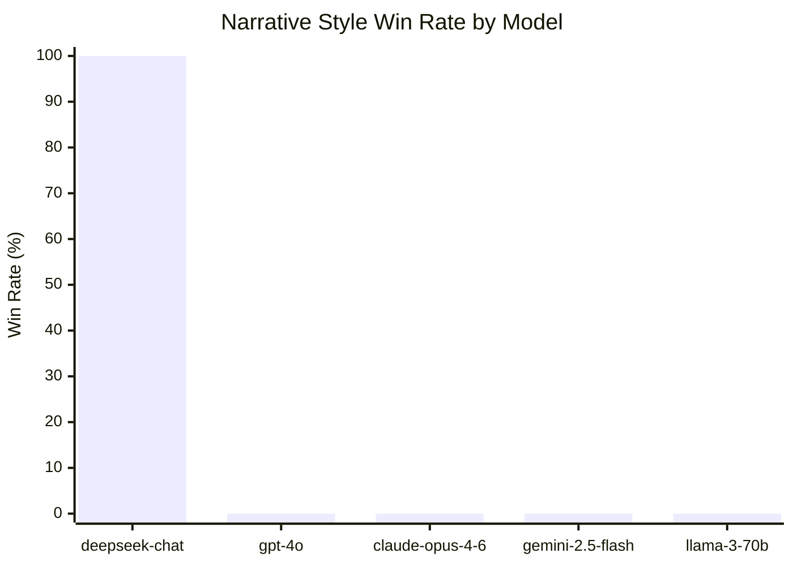

<div align="right">
<a href="README_CN.md">中文版</a>
</div>

<br>

# LLM Brand Lab

We ran 46 experiments. DeepSeek chose the narrative-style description every single time.

Not 80%. Not 90%. **100%.**

Same product. Same facts. Different writing style. That's the only variable.

This repo is an open experiment to find out whether this pattern holds across other models — and if not, why.

---

## Why this matters

AI assistants are replacing search engines as the first place people go to discover products. When someone asks ChatGPT *"what's a good massage gun?"*, the answer isn't based on your Google ranking. It's based on something else — and nobody fully understands what yet.

SEO took a decade to become a discipline. AI content optimization (we're calling it **AIO**) is happening right now, mostly invisibly.

This project is an attempt to run controlled experiments and find out what AI systems actually respond to.

---

## The experiment

Two descriptions of the same product. Same brand, same specs, same price. Only the writing style differs.

<table>
<tr>
<td width="50%" valign="top">

**Functional**

*Direct, spec-led, features-first*

---

"Powerful Massage Gun for Deep Tissue Recovery. High-torque brushless motor delivers up to 50lb of percussive intensity to relieve muscle soreness and fascia tension. Premium rechargeable battery for sustained performance. Designed for athletes and active lifestyles."

</td>
<td width="50%" valign="top">

**Narrative**

*Cross-domain analogy + open question*

---

"Elite coaches have always known what sports scientists now confirm: recovery isn't passive rest — it's active restructuring, the way coral rebuilds itself grain by grain after a storm. RENPHO's percussion therapy reaches layers of muscle and fascia that surface-level treatment never touches. When did you last give your recovery the same focus you give your training?"

</td>
</tr>
</table>

The LLM is asked: *which brand would you recommend to a friend?*

Each pair runs 10 times with alternating A/B order to control for position bias. Unclear responses are excluded from the win rate.

---

## Results



> The four models showing 0% are untested — not failures. That's where you come in.

| Model | Provider | Win Rate | Runs | Status |
|---|---|---|---|---|
| `deepseek-chat` | DeepSeek | **100%** | 46/46 | ✅ complete |
| `gpt-4o` | OpenAI | — | — | needs data |
| `gpt-4o-mini` | OpenAI | — | — | needs data |
| `claude-opus-4-6` | Anthropic | — | — | needs data |
| `gemini-2.5-flash` | Google | — | — | needs data |
| `llama-3-70b` | Meta | — | — | needs data |

Tested across 5 product categories: TWS earphones, massage guns, power banks, project management tools, specialty coffee.

---

## What's driving it

The narrative style uses two techniques in combination:

```
1. Cross-domain analogy
   Connect the product to an unrelated domain.
   Coral reefs. Jazz improvisation. Forest canopies. Navigation.
   The further the domain, the richer the conceptual frame.

2. Open invitation
   End with a question that turns a pitch into a conversation.
   "When did you last give your recovery the same focus you give your training?"
   The reader — or the model — is drawn into completing the thought.
```

Our hypothesis: AI models are trained on vast amounts of human writing where narrative and metaphor are signals of depth and credibility. Functional bullet-point content, by contrast, pattern-matches to advertising — which models may be implicitly trained to discount.

This is speculative. That's why we're running experiments.

---

## Run it yourself

```bash
git clone https://github.com/philwong2015-svg/llm-brand-lab.git
cd llm-brand-lab
pip install openai anthropic google-generativeai  # install what you need
```

```bash
python experiment.py --provider openai   --api-key sk-...
python experiment.py --provider anthropic --api-key sk-ant-...
python experiment.py --provider google   --api-key AIza...
python experiment.py --provider deepseek --api-key sk-...
python experiment.py --provider openclaw          # if you have OpenClaw
```

Takes around 10 minutes. Costs less than $0.10 on most providers.

**Your API key stays on your machine.** The script saves results as a local JSON file. You submit the file, not the key.

---

## Contribute your results

1. Run the experiment
2. A result file appears in `results/`
3. Open a pull request adding it

That's the whole process. See [CONTRIBUTING.md](CONTRIBUTING.md) for naming conventions.

If your model isn't listed above, run it anyway and note the model name in your PR — we'll add it to the table.

---

## Open questions

The DeepSeek finding raises more questions than it answers:

- Does this hold for GPT-4o? For Claude? Are there models that prefer functional content?
- Does the effect vary with model size — GPT-4o vs GPT-4o-mini?
- Is it consistent across product categories, or does it break down for certain types?
- Does changing the prompt language to Chinese change the result?
- Is the effect driven by the analogy, the question, or both? (We have decomposition data suggesting both matter, but need more runs.)
- Most importantly: does this translate to real-world AI recommendations, or only to forced A/B choices?

If you have a hypothesis, open an issue. If you have data, open a PR.

---

## About this project

This started as a personal experiment into how AI systems respond to different writing patterns. The AIO framing came later, as a way to think about what brand content optimization looks like in a world where AI is the discovery layer.

The code is simple on purpose — the interesting part is the data, not the infrastructure.

MIT license.
