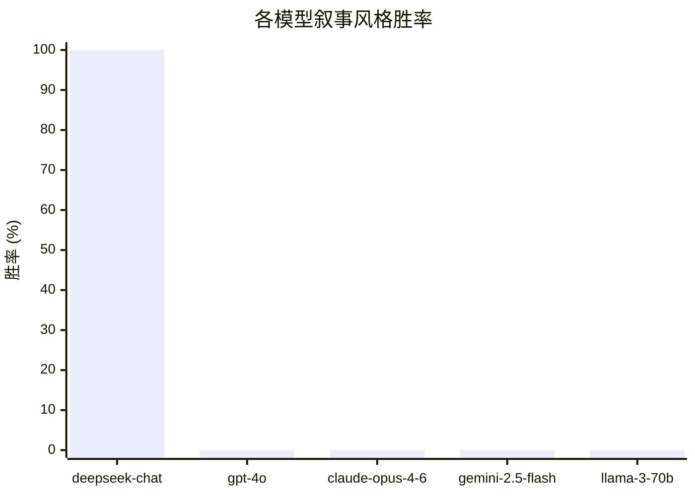

<div align="right">
<a href="README.md">English</a>
</div>

<br>

# LLM Brand Lab

我们跑了46次实验。DeepSeek每一次都选了叙事风格的描述。

不是80%，不是90%，是**100%**。

相同的产品，相同的事实，不同的写作风格。这是唯一的变量。

这个仓库是一个开放实验，目的是验证这个规律是否在其他模型上同样成立——如果不是，为什么。

---

## 为什么这件事重要

AI助手正在取代搜索引擎，成为人们发现产品的第一入口。当有人问ChatGPT"有什么好用的筋膜枪"时，答案不再取决于你的Google排名，而是取决于别的什么——而目前几乎没有人真正理解那个"别的什么"是什么。

SEO花了十年时间才成为一门学科。AI内容优化（我们称之为**AIO**）正在此时此刻发生，而且几乎是无声无息的。

这个项目试图通过受控实验，找出AI系统到底在响应什么。

---

## 实验设计

同一个产品的两段描述。同一品牌，同样的规格，同样的价格。只有写作风格不同。

<table>
<tr>
<td width="50%" valign="top">

**功能型**

*直接、规格导向、功能先行*

---

"专业筋膜枪，深层肌肉恢复。高扭矩无刷电机提供最高50磅的冲击强度，缓解肌肉酸痛和筋膜张力。高性能可充电电池持久续航。专为运动员和活跃生活方式设计。"

</td>
<td width="50%" valign="top">

**叙事型**

*跨领域类比 + 开放性问题*

---

"顶级教练早已知道运动科学现在证实的事：恢复不是被动休息——它是主动重建，就像珊瑚在风暴后一粒一粒重建自身。RENPHO的冲击疗法触达的肌肉和筋膜层，是表层按摩永远无法到达的地方。你上一次给予恢复与训练同等重视，是什么时候？"

</td>
</tr>
</table>

问LLM：*你会向朋友推荐哪个品牌？*

每对品牌跑10次，A/B顺序交替出现以控制位置偏差。回复不明确的结果从胜率统计中排除。

---

## 实验结果



> 显示0%的四个模型尚未测试，不是失败结果。这正是你可以贡献的地方。

| 模型 | 服务商 | 胜率 | 实验次数 | 状态 |
|---|---|---|---|---|
| `deepseek-chat` | DeepSeek | **100%** | 46/46 | ✅ 已完成 |
| `gpt-4o` | OpenAI | — | — | 待数据 |
| `gpt-4o-mini` | OpenAI | — | — | 待数据 |
| `claude-opus-4-6` | Anthropic | — | — | 待数据 |
| `gemini-2.5-flash` | Google | — | — | 待数据 |
| `llama-3-70b` | Meta | — | — | 待数据 |

覆盖5个产品品类：TWS蓝牙耳机、筋膜枪、移动电源、项目管理工具、精品咖啡。

---

## 背后的机制

叙事风格同时使用了两种技巧：

```
1. 跨领域类比
   将产品与不相关的领域联系起来。
   珊瑚礁、爵士即兴、森林树冠、航海导航。
   领域跨度越大，概念框架越丰富。

2. 开放邀请
   以一个问题结尾，将推销变成对话。
   "你上一次给予恢复与训练同等重视，是什么时候？"
   读者——或模型——被引导着去完成这个思考。
```

我们的假设：AI模型在海量人类写作上训练，其中叙事和隐喻是深度与可信度的信号。功能性的要点列表，相反，更接近广告文案的模式——而模型可能被隐式训练为对此打折扣。

这只是假设。这就是我们要跑实验的原因。

---

## 自己跑一遍

```bash
git clone https://github.com/philwong2015-svg/llm-brand-lab.git
cd llm-brand-lab
pip install openai anthropic google-generativeai  # 按需安装
```

```bash
python experiment.py --provider openai   --api-key sk-...
python experiment.py --provider anthropic --api-key sk-ant-...
python experiment.py --provider google   --api-key AIza...
python experiment.py --provider deepseek --api-key sk-...
python experiment.py --provider openclaw          # 如果你有OpenClaw
```

大约10分钟，大多数服务商费用不到$0.10。

**你的API key始终留在本地。** 脚本将结果保存为本地JSON文件。你提交的是文件，不是key。

---

## 贡献你的结果

1. 跑完实验
2. `results/` 目录下会生成结果文件
3. 提交PR把文件加进来

就这些。详见 [CONTRIBUTING.md](CONTRIBUTING.md) 的命名规范。

如果你用的模型不在上表中，照样跑，在PR说明里注明模型名称——我们会把它加进去。

---

## 待探索的问题

DeepSeek的结果提出的问题比它回答的更多：

- GPT-4o也会这样吗？Claude呢？有没有模型反而偏好功能型内容？
- 模型规模会影响结果吗——GPT-4o vs GPT-4o-mini？
- 这个效果在不同品类中是否一致，还是在某些类型上会失效？
- 把prompt换成中文，结果会变吗？
- 效果是由类比驱动的、问题驱动的，还是两者都需要？（我们有分解实验的初步数据，但需要更多样本。）
- 最关键的：这个效果能迁移到真实世界的AI推荐场景，还是只在强制A/B选择中成立？

有假设的，开issue。有数据的，提PR。

---

## 关于这个项目

这最初是一个关于AI系统如何响应不同写作模式的个人实验。AIO这个框架是后来形成的，作为一种理解"当AI成为发现层时，品牌内容优化应该是什么样子"的方式。

代码刻意保持简单——有价值的部分是数据，不是基础设施。

MIT 许可证。
