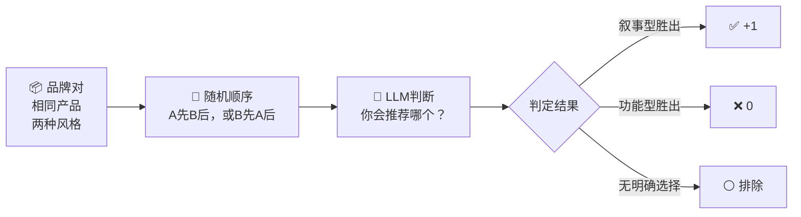

<div align="right">

[English](README.md) · [中文](README_CN.md)

</div>

<div align="center">

# LLM Brand Lab

**写作风格会影响AI推荐哪个品牌吗？**

*一项跨语言模型的众包实验*

[](LICENSE)
[](CONTRIBUTING.md)
[](#结果)

</div>

---

## 研究问题

当你问AI"我该买哪个品牌？"时，品牌内容的**写作风格**是否会影响它的推荐——与产品质量本身无关？

我们将两种风格直接对比。两者描述**完全相同的产品**，包含**完全相同的事实**，唯一的变量是写作方式。

<table>
<tr>
<th width="50%">🔧 功能型写法</th>
<th width="50%">🌊 叙事型写法</th>
</tr>
<tr>
<td>

*"专业筋膜枪，深层肌肉恢复。高扭矩无刷电机提供最高50磅的冲击强度，缓解肌肉酸痛和筋膜张力。专为运动员和活跃生活方式设计。"*

</td>
<td>

*"顶级教练早已知道运动科学现在证实的事：恢复不是被动休息——它是主动重建，就像珊瑚在风暴后一粒一粒重建自身。你上一次给予恢复与训练同等重视，是什么时候？"*

</td>
</tr>
</table>

---

## 实验设计



每个品牌对每个模型测试 **10次**，A/B顺序交替出现以控制位置偏差。你的API key保留在本地——只有结果JSON文件会被提交。

---

## 结果

> 🙋 **目前只有一个模型的数据。我们需要你的贡献来完成这张图。**

| 模型 | 服务商 | 叙事型胜率 | 实验次数 | 贡献者 |
|------|--------|-----------|---------|--------|
| `deepseek-chat` | DeepSeek |  **100%** | 46 | [@philwong2015-svg](https://github.com/philwong2015-svg) |
| `gpt-4o` | OpenAI | *尚未测试* | — | 🙋 是你吗？ |
| `gpt-4o-mini` | OpenAI | *尚未测试* | — | 🙋 是你吗？ |
| `claude-opus-4-6` | Anthropic | *尚未测试* | — | 🙋 是你吗？ |
| `gemini-2.5-flash` | Google | *尚未测试* | — | 🙋 是你吗？ |
| `llama-3-70b` | Groq/Meta | *尚未测试* | — | 🙋 是你吗？ |

**DeepSeek在5个品类的46次实验中，100%选择了叙事风格内容。** 这是普遍现象还是模型特有行为？这正是我们需要弄清楚的。

---

## 运行实验

### 1. 克隆仓库

```bash
git clone https://github.com/philwong2015-svg/llm-brand-lab.git
cd llm-brand-lab
```

### 2. 安装依赖

```bash
pip install openai          # OpenAI 或 DeepSeek
pip install anthropic       # Anthropic Claude
pip install google-generativeai  # Google Gemini
```

### 3. 运行

```bash
# OpenAI
python experiment.py --provider openai --api-key sk-...

# Anthropic
python experiment.py --provider anthropic --api-key sk-ant-...

# Google Gemini
python experiment.py --provider google --api-key AIza...

# DeepSeek
python experiment.py --provider deepseek --api-key sk-...

# OpenClaw
python experiment.py --provider openclaw
```

或使用环境变量（推荐）：

```bash
export OPENAI_API_KEY=sk-...
python experiment.py --provider openai
```

**你的API key不会被发送到任何地方。结果保存为本地JSON文件。**

大约需要10分钟，大多数服务商费用不到$0.10。

### 4. 提交结果

提交PR，将 `results/` 目录下的结果文件添加到仓库即可。

---

## 测试品类

实验涵盖5个品类，每个品类包含真实品牌的功能型文案及其叙事型改写版：

| # | 品类 | 品牌 |
|---|------|------|
| 1 | TWS蓝牙耳机 | Soundcore |
| 2 | 筋膜枪 | RENPHO |
| 3 | 移动电源 | Baseus |
| 4 | 项目管理工具 | FlowPlan vs Taskwave |
| 5 | 精品咖啡 | 晨岭 vs 云谷 |

---

## 叙事公式

叙事风格固定使用两种技巧：

```
跨领域类比
  └── 将产品与不相关领域联系
      （珊瑚礁、爵士乐、森林树冠、航海导航）

开放邀请
  └── 以反思性问题结尾，邀请读者参与
      （"你上一次给予恢复与训练同等重视，是什么时候？"）
```

我们将这种组合称为 **AIO（AI内容优化）**——类比SEO，但针对AI推荐系统。

---

## 待探索问题

我们正在研究叙事偏好是否因以下因素而异：

- **模型系列** — OpenAI vs Anthropic vs Google vs 开源模型？
- **模型规模** — GPT-4o vs GPT-4o-mini？
- **产品品类** — 消费品 vs B2B工具？
- **Prompt语言** — 英文 vs 中文？

欢迎在 [Discussions](../../discussions) 中加入讨论。

---

## 如何贡献

详见 [CONTRIBUTING.md](CONTRIBUTING.md)。

简短版：运行实验 → 获得结果文件 → 提交PR。

---

## 许可证

MIT — 自由使用，发表时请注明出处。
